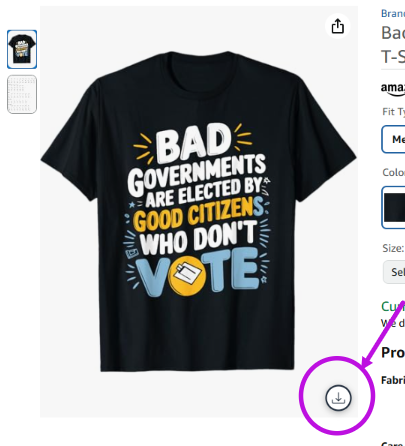
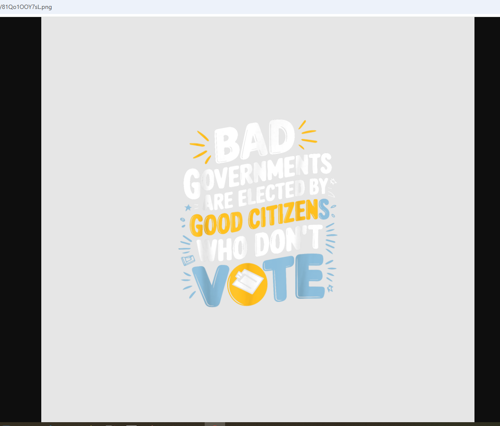

# PodExport - Merch by Amazon T-Shirt Design Downloader

  
  
  <h3>Download t-shirt designs from Merch by Amazon with ease</h3>
  
  
  
  
<strong>Version 1.0.0</strong> | Made by <a href="https://simolog.com" target="_blank">Mohamed Chaabi</a>

---

## 📖 Description

**PodExport** is a powerful Chrome extension designed to simplify the process of downloading t-shirt designs from Merch by Amazon. Whether you're a designer, researcher, or simply want to save designs for inspiration, PodExport makes it effortless to download high-quality PNG images directly from Amazon's Merch platform.

### ✨ Key Features
- 🚀 **One-click download** - Download designs instantly with a single click
- 🎨 **High-quality images** - Get the best resolution PNG files
- 🌍 **Multi-region support** - Works on all Amazon regional sites
- ⚡ **Lightweight** - Minimal resource usage, fast performance

---

## 🛠️ Installation

### From Chrome Web Store (Recommended)

---

## 🚀 How It Works

### Step 1: Installation
1. Click the "Install from Chrome Web Store" button above
2. Add the extension to your Chrome browser
3. The PodExport icon will appear in your browser toolbar

### Step 2: Using the Extension
1. **Visit a Merch by Amazon design page**  
  For example: [this t-shirt design](https://www.amazon.com/Vote-Election-Student-Council-Apparel/dp/B0CXHWQJR7?customId=B0752XJYNL&customizationToken=MC_Assembly_1%23B0752XJYNL&th=1&psc=1)  
 

 
2. **Click The Download Button**  
When you click the download button, a new tab will open with the original design as a PNG image.  
 

---

## ⭐ Support

### Give us a Star! ⭐
If you find PodExport useful, please give us a star on GitHub! Your support helps us improve the extension and add new features.

### Rate & Review
- ⭐ Rate the extension on Chrome Web Store
- 📝 Leave a review to help other users
- 🐛 Report bugs or suggest features
---

## 📄 License

This project is licensed under the MIT License - see the [LICENSE](LICENSE) file for details.

---

## 🤝 Contributing

Contributions are welcome! Please feel free to submit a Pull Request. For major changes, please open an issue first to discuss what you would like to change.

---

  
© 2025 PodExport. by <a href="https://simolog.com" target="_blank">Mohamed Chaabi</a>

